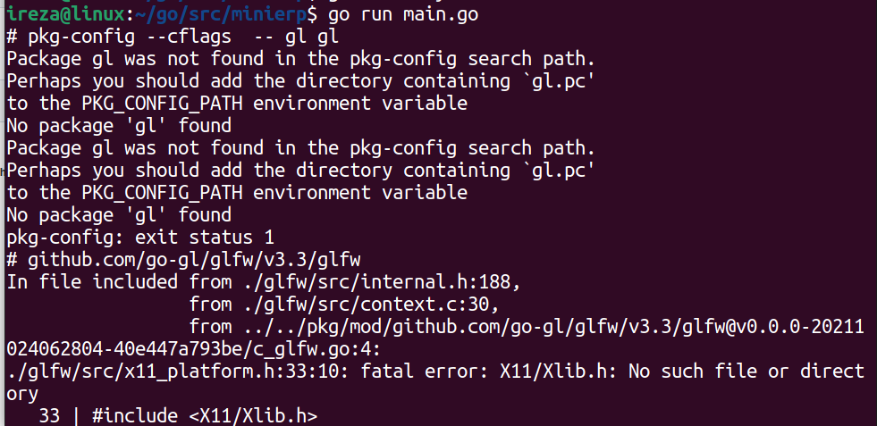

### if error when build or go run use this method because Some Linux systems lack the compile headers for graphics libraries that are installed.



> now use command for gcc libg install
```bash
sudo apt-get install golang gcc libgl1-mesa-dev xorg-dev
```
